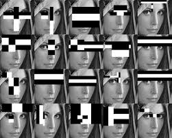
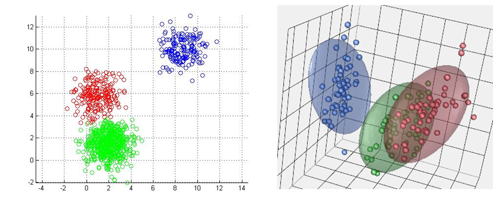
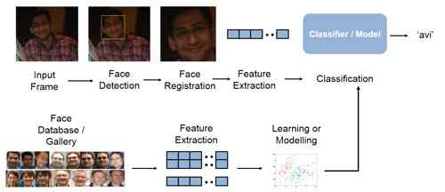
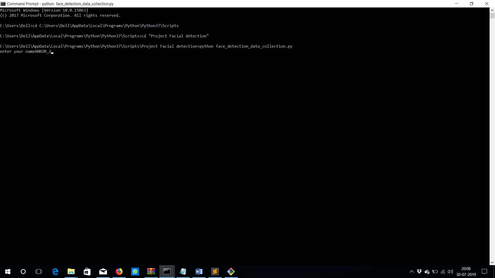
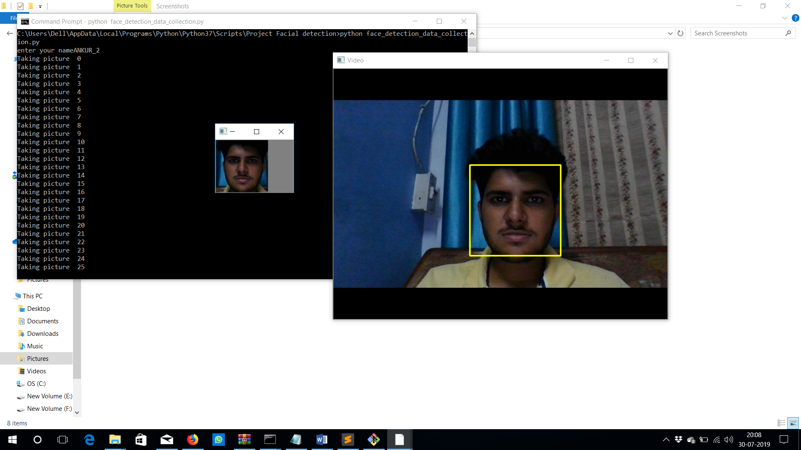

# Facial_Detection_using_OpenCV_and_KNN
This project Takes your photo *_(ROI is passed after Detection by Haarcascade)_*as data input where captured image is converted to a numpy array (3d-matrix) and is fed to the algo.. The Algo. forms various clusters based on photos of various people and when a test image is served, the algo. output the name of file that contains most compareable (similar) photos as of test image. In this case KNN is the classification algo, but SVM (With kernels), NN can also be used.
## Frontal Face HaarCascade

## 3-D Cluster visualization

## Project Pipeline

### Procedure of Running the Project
- Install python 3 and download all requirments
- To Collect Data:- Run Collection of Face data, and provide inputs
- To Test the algo,:- Use KNN for Face detection

### Drawback
- Haarcascade is not a SOTA detector
- Model works on Compairing Similarities, so additional threshold needs to be added, to stop misclassification. Eg. You and your father can be classified as 1 if Model doesn't have data of your father
- Any stranger will be classified as "Most similar face" in absence of threshold.

### Further advancements in Project:
–	Instead of KNN, Convolutional Neural Networks or more complex networks like AlexNet, ResNet, F-CNN etc. can be used for higher accuracy with Image data and will actually learn facial features (Extracted by better DL model and object detection model)
–	Using HD camera modules with Raspberry pi and Cloud Cognitive Service {Or algo. Like MobileNet} for facial detection. As soon as a particular face is detected, its attendance is marked in Server Spread Sheet. The facial data of selected students of a class can be given as training data using some Memory device like a Pen drive. The Concerned Teacher can access the sheet of his lecture. The attendance counting can be unified with  time counter and other technologies like Bi-Directional Counter, Rfid, Biometrics etc.

## Screenshots

")

